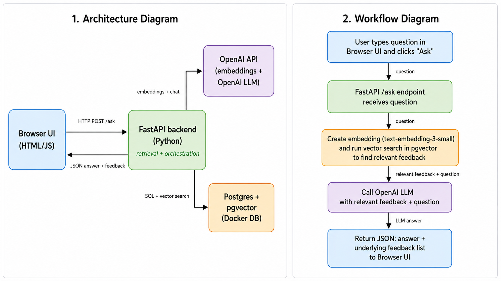

# Customer Decision Copilot

A Retrieval-Augmented Generation (RAG) app that helps product teams understand customer feedback by combining semantic search with grounded LLM answers.

## Architecture and Workflow

The diagram below shows both the high-level system architecture and the end-to-end workflow of the project, from user question to retrieved feedback and final answer.



## What it does

- Stores customer feedback (`source`, `rating`, `comment`) in PostgreSQL.
- Generates vector embeddings for each comment using OpenAI `text-embedding-3-small`.
- Uses pgvector similarity search (`embedding <-> query_embedding`) to retrieve the most relevant feedback for a question.
- Calls `gpt-4o-mini` with the user question and retrieved feedback to produce a concise, grounded answer.
- Displays both the generated answer and the underlying feedback in a browser UI so the output stays traceable.

## Tech stack

- **Backend:** FastAPI (Python 3.11)
- **Database:** PostgreSQL with pgvector (Docker image `ankane/pgvector`)
- **Vector search:** pgvector `vector(1536)` columns with `<->` similarity
- **LLM + embeddings:** OpenAI via `langchain-openai` (`gpt-4o-mini`, `text-embedding-3-small`)
- **Infra:** Docker, `psycopg2`, `python-dotenv`

## How to run

1. Start PostgreSQL + pgvector in Docker:

   ```bash
   docker run --name postgres-pgvector \
     -e POSTGRES_USER=myuser \
     -e POSTGRES_PASSWORD=mypassword \
     -e POSTGRES_DB=mydatabase \
     -p 5432:5432 \
     -d ankane/pgvector
   ```

2. Create tables and enable pgvector:

   ```sql
   CREATE EXTENSION IF NOT EXISTS vector;

   CREATE TABLE documents (
     id SERIAL PRIMARY KEY,
     title TEXT NOT NULL,
     source TEXT,
     content TEXT NOT NULL,
     embedding vector(1536),
     created_at TIMESTAMPTZ DEFAULT NOW()
   );

   CREATE TABLE feedback (
     id SERIAL PRIMARY KEY,
     source TEXT,
     rating INT,
     comment TEXT NOT NULL,
     embedding vector(1536),
     created_at TIMESTAMPTZ DEFAULT NOW()
   );
   ```

3. Set environment variables in `.env` at the project root:

   ```env
   DB_HOST=localhost
   DB_PORT=5432
   DB_USER=myuser
   DB_PASSWORD=mypassword
   DB_NAME=mydatabase

   OPENAI_API_KEY=sk-your-key
   ```

4. Seed and embed feedback:

   ```bash
   python load_feedback_csv.py
   python embed_data.py
   ```

5. Run the API:

   ```bash
   uvicorn api:app --reload
   ```

6. Open the frontend:

- Go to `http://127.0.0.1:8000`
- Ask questions such as:
  - `What are users complaining about onboarding?`
  - `What do users say about pricing for small teams?`

## Core code pieces

- `init_db.py` — inserts initial sample documents and feedback
- `load_feedback_csv.py` — loads realistic feedback from CSV
- `embed_data.py` — generates embeddings for documents and feedback
- `retrieve.py` — tests semantic retrieval from Python
- `api.py` — serves the `/ask` endpoint and browser UI

## Why this is useful

This project demonstrates an end-to-end RAG pipeline:
- Data modeling in PostgreSQL
- Vector search with pgvector
- LLM integration using OpenAI and LangChain
- API and UI integration with FastAPI

It is especially relevant for product, analytics, and FinTech-facing AI applications where customer voice and explainable insights matter.